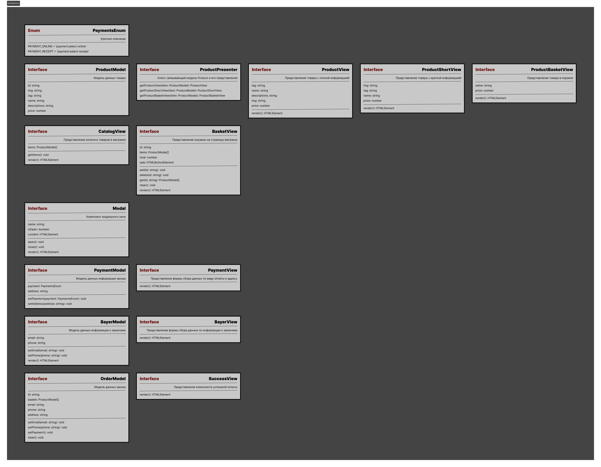

# Проектная работа "Веб-ларек"

Репозиторий: https://github.com/SinitsaBogdan/web-larek-frontend

Стек: HTML, SCSS, TS, Webpack

Структура проекта:

-   src/ — исходные файлы проекта
-   src/components/ — папка с JS компонентами
-   src/components/base/ — папка с базовым кодом
-   src/types/ — папка с типами

Важные файлы:

-   src/pages/index.html — HTML-файл главной страницы
-   ! src/types/index.ts — файл с типами
-   src/index.ts — точка входа приложения
-   src/styles/styles.scss — корневой файл стилей
-   src/utils/constants.ts — файл с константами
-   src/utils/utils.ts — файл с утилитами

## Установка и запуск

Для установки и запуска проекта необходимо выполнить команды

```
npm install
npm run start
```

## Сборка

```
npm run build
```

## Об архитектуре

Взаимодействия внутри приложения происходят через события.
Модели инициализируют события, слушатели событий в основном коде выполняют передачу данных компонентам отображения,
а также занимаются вычислениями между этой передачей, и еще они меняют значения в моделях.

## Архитектура

## 

---

## Базовый код

### Перечисление `PaymentsEnum`

Перечисление событий выбора типа оплаты

---

### Перечисление `StatusOrderEnum`

Перечисление статуса оформления заказа

---

---

### Класс `ProductModel<T>`

Модель данных товара в проекте. Данные модели используется для отрисовки в главном каталоге приложения, модальном окне предпросмотра и пользовательской корзине.

#### **Используемые типы:**

```
type ProductType {
    id: string;
    img: string;
    tag: string;
    name: string;
    descriptions: string;
    price: number;
}
```

#### **Наследуемые интерфейсы:**

-   `IProductModel<T>`

#### **Переменные класса:**

-   private id: string - Уникальный идентификатор товара
-   private img: string - Ссылка на изображение товара
-   private tag: string - Категория товара
-   private name: string - Наименование товара
-   private descriptions: string - Описание товара
-   private price: number - Стоимость товара

#### **Конструктор класса:**

```
constructor(obj: ProductType) {
  this.id = obj.id
  this.img = obj.img
  this.tag = obj.tag
  this.name = obj.name
  this.descriptions = obj.descriptions
  this.price = obj.price
}
```

#### **Методы класса:**

-   `getId(): string` - Запрос уникального идентификатора товара.
-   `setId(value: string): void;` - Запись уникального идентификатора товара.
-   `getImg(): string` - Запрос ссылки на изображение товара.
-   `setImg(value: string): void;` - Запись ссылки на изображение товара.
-   `getTag(): string` - Запрос категории товара.
-   `setTag(value: string): void;` - Запись категории товара.
-   `getName(): string` - Запрос наименования товара.
-   `setName(value: string): void;` - Запись наименования товара.
-   `getDescriptions(): string` - Запрос описания товара.
-   `setDescriptions(value: string): void;` - Запись описания товара.
-   `getPrice(): number` - Запрос стоимости товара.
-   `setPrice(value: number): void;` - Запись стоимости товара.

---

### Класс `ProductUI<T>`

Класс представления UI компонента для отрисовки карточки с полной информацией о товаре для содержимого модального окна предпросмотра товара.

#### **Переменные класса:**

-   `model: IProductModel` - Модель с данными

#### **Конструктор класса:**

```
constructor(model: IProductModel) {
  this.model = model
}
```

#### **Методы класса:**

-   `render(template: HTMLElement): HTMLElement` <br>
    Метод сборки UI компонента, на вход принимает html шаблон. На выход отдает скомпанованный html.

---

### Класс `ProductShortUI<T>`

Класс представления UI компонента для отрисовки карточки с краткой информацией о товаре для главного каталога приложения.

#### **Переменные класса:**

-   `model: IProductModel` - Модель с данными

#### **Конструктор класса:**

```
constructor(model: IProductModel) {
  this.model = model
}
```

#### **Методы класса:**

-   `render(template: HTMLElement): HTMLElement` <br>
    Метод сборки UI компонента, на вход принимает html шаблон. На выход отдает скомпанованный html.

---

### Класс `ProductBasketUI<T>`

Класс представления UI компонента для отрисовки карточки с информацией о товаре для размещения в корзине.

#### **Переменные класса:**

-   `model: IProductModel` - Модель с данными

#### **Конструктор класса:**

```
constructor(model: IProductModel) {
  this.model = model
}
```

#### **Методы класса:**

-   `render(template: HTMLElement): HTMLElement` <br>
    Метод сборки UI компонента, на вход принимает html шаблон. На выход отдает скомпанованный html.

---

---

### Класс `CatalogModel<T>`

Модель каталога (хранилища) товаров в проекте. Используется для отрисовки основной коллекции товаров на странице приложения.

#### **Используемые типы:**

```
type CatalogType = {
    items: IProductModel[]
}
```

#### **Наследуемые интерфейсы:**

-   `ICatalogModel<T>`

#### **Переменные класса:**

-   private items: IProductModel[] - Массив товаров в приложении.

#### **Конструктор класса:**

```
constructor(obj?: CatalogType) {
  this.items = obj?.items ?? IProductModel[]
}
```

#### **Методы класса:**

-   `getItems(): IProductModel[];` - Запрос списка товаров в корзине.
-   `getItem(id: string): IProductModel;` - Запрос товара по id.

---

### Класс `CatalogUI<T>`

Класс представления UI компонента для отрисовки главного каталога товаров на странице.

#### **Переменные класса:**

-   `model: ICatalogModel` - Модель с данными

#### **Конструктор класса:**

```
constructor(model: ICatalogModel) {
  this.model = model
}
```

#### **Методы класса:**

-   `render(template: HTMLElement): HTMLElement` <br>
    Метод сборки UI компонента, на вход принимает html шаблон. На выход отдает скомпанованный html.

---

---

### Класс `BasketModel<T>`

<!-- TODO: Может быть потребуется добавить Action для обработки событий -->

Модель данных корзины с товарами. Хранит в себе позиции добавленых пользователем товаров. Передается объектом в Заказ при подтвержении всех позиций пользователем. После изменения списка позиций должен происходить пересчет `total`.

#### **Используемые типы:**

```
type BasketType = {
    items: IProductModel[]
    total?: number
}
```

#### **Наследуемые интерфейсы:**

-   `IBasketModel<T>`

#### **Переменные класса:**

-   private items: IProductModel[] - Массив товаров добавленных в пользовательскую корзину
-   private total: number - Общая сумма товаров в корзине

#### **Конструктор класса:**

```
constructor(obj?: BasketType) {
  this.items = obj?.items ?? IProductModel[]
  this.total = obj?.total ?? 0
}
```

#### **Методы класса:**

-   `getItems(): IProductModel[]` - Запрос списка товаров в корзине.
-   `setItems(value: IProductModel[]): void;` - Запись списка товаров в корзину.
-   `getTotal(): number` - Запрос общей суммы позиций товаров в корзине.
-   `setTotal(value: number): void;` - Запись общей суммы позиций товаров в корзине.
-   `add(id: string): void` - Добавление нового товара в корзину.
-   `delete(id: string):  void` - Удаление товара из корзины.

### Класс `BasketUI<T>`

Класс представления UI компонента для отрисовки полной корзины (один из шагов пользовательского сценария).

#### **Переменные класса:**

-   `model: IBasketModel` - Модель с данными

#### **Конструктор класса:**

```
constructor(model: IModal) {
  this.model = model
}
```

#### **Методы класса:**

-   `render(template: HTMLElement): HTMLElement` <br>
    Метод сборки UI компонента, на вход принимает html шаблон. На выход отдает скомпанованный html.

---

### Класс `BasketShortUI<T>`

Класс представления UI компонента для отрисовки краткой корзины (для шапки магазина).

#### **Переменные класса:**

-   `model: IBasketModel` - Модель с данными

#### **Конструктор класса:**

```
constructor(model: IModal) {
  this.model = model
}
```

#### **Методы класса:**

-   `render(template: HTMLElement): HTMLElement` <br>
    Метод сборки UI компонента, на вход принимает html шаблон. На выход отдает скомпанованный html.

---

---

### Класс `Modal<T>`

<!-- TODO: Может быть потребуется добавить Action для обработки событий -->

Модель данных модального окна. В используется как шаблонный компонент (обертка) с контейнером под другой контент.

#### **Используемые типы:**

```
type ModalType = {
      name: string
      isOpen: boolean
      content: HTMLElement
}
```

#### **Наследуемые интерфейсы:**

-   `IModal`

#### **Переменные класса:**

-   private name: string - Наименование модального окна
-   private isOpen: boolean - Модальное окно открыто \ закрыто
-   private content: HTMLElement - Вложенный контент в модальное окно

#### **Конструктор класса:**

```
constructor(obj: ModalType) {
  this.name = obj.name? ?? null
  this.isOpen = obj?.isOpen? ?? false
  this.content = obj?.content? ?? undefined
}
```

#### **Методы класса:**

-   `getName(): string` - Запрос наименования модального окна.
-   `setName(value: string): void;` - Запись наименования модального окна.
-   `getIsOpen(): boolean` - Запрос статуса активности модального окна.
-   `setIsOpen(value: boolean): void;` - Запись статуса активности модального окна.
-   `getContent(): HTMLElement` - Запрос содержимого модального окна.
-   `setContent(value: HTMLElement): void;` - Запись содержимого модального окна.
-   `open(): void;` - Открыть модальное окно.
-   `close(): void;` - Скрыть модальное окно.

---

### Класс `ModalUI`

Класс представления UI компонента для отрисовки модального окна.

#### **Переменные класса:**

-   `model: IModal` - Модель с данными

#### **Конструктор класса:**

```
constructor(model: IModal) {
  this.model = model
}
```

#### **Методы класса:**

-   `render(template: HTMLElement): HTMLElement` <br>
    Метод сборки UI компонента, на вход принимает html шаблон. На выход отдает скомпанованный html.

---

---

### Класс `PaymentModel<T>`

<!-- TODO: Может быть потребуется добавить Action для обработки событий -->

Модель данных о типе оплаты заказа и адресе доставки. Хранит в себе тип оплаты из перечисления `PaymentsEnum` и адрес доставки.
Используется как содержимое в UI модальной формы на странице магазина (один из шагов пользовательского сценария).

#### **Используемые типы:**

```
type PaymentType = {
      payment: PaymentsEnum
      address: string
}
```

#### **Наследуемые интерфейсы:**

-   `IPaymentModel<T>`

#### **Переменные класса:**

-   private payment: PaymentsEnum - Тип оплаты заказа
-   private address: string - Адрес для доставки заказа

#### **Конструктор класса:**

```
constructor();
constructor(obj: PaymentType) {
  this.payment = obj?.payment? ?? null
  this.address = obj?.address? ?? null
}
```

#### **Методы класса:**

-   `getPayment(): PaymentType` - Запрос типа оплаты заказа.
-   `setPayment(value: PaymentType): void;` - Запись типа оплаты заказа.
-   `getAddress(): string` - Запрос адреса доставки заказа.
-   `setAddress(value: string): void;` - Запись адреса доставки заказа.

---

### Класс `PaymentUI`

Класс представления UI компонента для отрисовки содержимого формы в модальном окне (один из шагов пользовательского сценария).

#### **Переменные класса:**

-   `model: IPaymentModel` - Модель с данными

#### **Конструктор класса:**

```
constructor(model: PaymentModel) {
  this.model = model
}
```

#### **Методы класса:**

-   `render(template: HTMLElement): HTMLElement` <br>
    Метод сборки UI компонента, на вход принимает html шаблон. На выход отдает скомпанованный html.

---

---

### Класс `BayerModel<T>`

<!-- TODO: Может быть потребуется добавить Action для обработки событий -->

Модель данных о пользователе. Хранит в себе контактный телефон и почту пользователя.
Используется как содержимое в UI модальной формы на странице магазина (один из шагов пользовательского сценария).

#### **Используемые типы:**

```
type BayerType = {
      email: string
      phone: string
}
```

#### **Наследуемые интерфейсы:**

-   `IBayerModel<T>`

#### **Переменные класса:**

-   private email: string - Электронная почта покупателя
-   private phone: string - Контактный телефон покупателя

#### **Конструктор класса:**

```
constructor();
constructor(obj: BayerType) {
  this.email = obj?.email? ?? null
  this.phone = obj?.phone? ?? null
}
```

#### **Методы класса:**

-   `getEmail(): string` - Запрос элеткронной почты покупателя.
-   `setEmail(value: string): void;` - Запись элеткронной почты покупателя.
-   `getPhone(): string` - Запрос контактного телефона покупателя.
-   `setPhone(value: string): void;` - Запись контактного телефона покупателя.

---

### Класс `BayerUI<T>`

Класс представления UI компонента для отрисовки содержимого формы в модальном окне (один из шагов пользовательского сценария).

#### **Переменные класса:**

-   `model: IBayerModel` - Модель с данными

#### **Конструктор класса:**

```
constructor(model: IBayerModel) {
  this.model = model
}
```

#### **Методы класса:**

-   `render(template: HTMLElement): HTMLElement` <br>
    Метод сборки UI компонента, на вход принимает html шаблон. На выход отдает скомпанованный html.

---

---

### Класс `OrderModel<T>`

Модель заказа. Наполняется данными постепенно по мере прохождения по пользовательскому сценарию оформления заказа.
Хранит в себе все данные о формируемом заказе для дальнейшей передачи на сервер.
Данные из модели так же используются для UI компонентов.

#### **Используемые типы:**

```
type OrderType = {
      status: StatusOrderEnum
      basket: IBasketModel
      payment: IPaymentModel
      bayer: IBayerModel
}
```

#### **Наследуемые интерфейсы:**

-   `IOrderModel<T>`

#### **Переменные класса:**

-   private status: StatusOrderEnum - Статус формирования заказа
-   private basket: IBasketModel - Список позиций заказа ( корзина )
-   private payment: IPaymentModel - Данные о оплате и адресе доставки
-   private bayer: IBayerModel - Данные о покупателе

#### **Конструктор класса:**

```
constructor();
constructor(obj: OrderType) {
  this.status = obj?.status? ?? null
  this.basket = obj?.basket? ?? null
  this.payment = obj?.payment? ?? null
  this.bayer = obj?.bayer? ?? null
}
```

#### **Методы класса:**

-   `getStatus(): StatusOrderEnum` - Запрос статуса заказа.
-   `setStatus(value: StatusOrderEnum): void;` - Запись статуса заказа.
-   `getBasket(): IBasketModel` - Запрос позиций заказа (корзины).
-   `setBasket(value: IBasketModel): void;` - Запись позиций заказа (корзины).
-   `getPayment(): IPaymentModel` - Запрос данных об оплате и адресе.
-   `setPayment(value: IPaymentModel): void;` - Запись данных об оплате и адресе.
-   `getBayer(): IBayerModel` - Запрос данных об покупателе.
-   `setBayer(value: IBayerModel): void;` - Запись данных об покупателе.

---

---

### Класс `CompletingPurchaseModel<T>`

<!-- TODO: Может быть потребуется добавить Action для обработки событий -->

Модель информации о статусе заказа. Данные модели Используются для вывода информации в модальном окне, которое обозначает завершение формирования заказа.

#### **Используемые типы:**

```
type CompletingPurchaseType = {
      title: string
      desctiprions: string
      textBtnClose?: string
}
```

#### **Наследуемые интерфейсы:**

-   `ICompletingPurchaseModel<T>`

#### **Переменные класса:**

-   private title: string - Заголловок оповещения
-   private desctiprions: string - Описание оповещения
-   private textBtnClose: string - Текст акцентной кнопки

#### **Конструктор класса:**

```
    constructor();
    constructor(obj?: CompletingPurchaseType) {
      this.title = obj?.title? ?? null,
      this.desctiprions = obj?.desctiprions? ?? null,
      this.textBtnClose = obj?.textBtnClose? ?? null
    }
```

#### **Методы класса:**

-   `getTitle(): string` - Запрос заголовка оповещения.
-   `setTitle(value: string): void;` - Запись заголовка оповещения.
-   `getDesctiprions(): string` - Запрос текста описания оповещения.
-   `setDesctiprions(value: string): void;` - Запись текста описания оповещения.
-   `getTextBtnClose(): string` - Запрос текста акцентной кнопки оповещения.
-   `setTextBtnClose(value: string): void;` - Запись текста акцентной кнопки оповещения.

---

### Класс `CompletingPurchaseUI<T>`

Класс представления UI компонента для отрисовки оповещения о завершении формирования заказа.

#### **Переменные класса:**

-   `model: ICompletingPurchaseModel` - Модель с данными

#### **Конструктор класса:**

```
constructor(model: ICompletingPurchaseModel) {
  this.model = model
}
```

#### **Методы класса:**

-   `render(template: HTMLElement): HTMLElement` <br>
    Метод сборки UI компонента, на вход принимает html шаблон. На выход отдает скомпанованный html.

# ==============================================================================================================

# ==============================================================================================================

# ==============================================================================================================

Вот список вопросов, которые по заданию должна раскрывать документация:

-   Из каких основных частей состоит архитектура проекта? Это могут быть данные, отображения, экраны и так далее.
-   Зачем нужны эти части, какие функции они выполняют?
-   Как части взаимодействуют?
-   Какие данные используются в приложении? Можете записать конкретные типы данных или интерфейсов, пояснив их функции.
-   Из каких компонентов состоит приложение?
-   Как реализованы процессы в приложении?
    Через события или как-то иначе, например: с помощью единого контроллера или promise-based flow, как в готовом кейсе в предыдущем спринте.

# ==============================================================================================================

# ==============================================================================================================

# ==============================================================================================================

-   Нужно описать, для чего требуется каждый класс, какие функции он выполняет

-   Вам нужно четко описать, что приходит в конструктор класса, и какого типа эти данные. Это нужно исправить в каждом описании класса

-   Нужно в каждом описании указать все присутствующие свойства, методы и сеттеры класса с типами данных. Пример https://disk.yandex.ru/i/LSdOEIzi6C-3CA

# ==============================================================================================================

# ==============================================================================================================

# ==============================================================================================================
